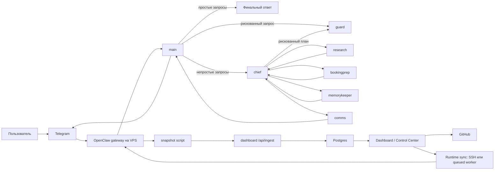
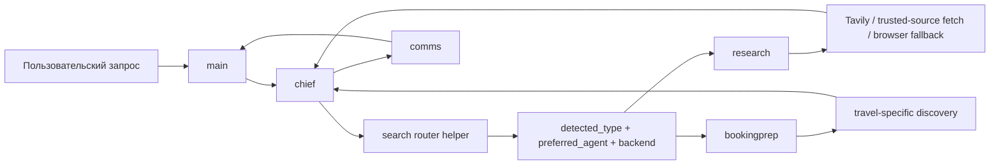

# Карта системы Hobbes

Этот документ описывает всю систему Hobbes как одно целое: OpenClaw-рантайм, Telegram-вход, агентов, поисковый контур, дашборд, Control Center, GitHub и синхронизацию обратно на VPS.

## 1. Общая схема

## 2. Из каких слоев состоит Hobbes

### Слой 1. Пользовательский вход

Это Telegram.

Пользователь пишет боту, а не напрямую агентам.
Telegram здесь играет роль входной двери.

### Слой 2. Живой рантайм на VPS

Здесь работает OpenClaw.

Он:

- принимает входящий трафик;
- держит рабочие пространства агентов;
- запускает внутреннюю маршрутизацию;
- обслуживает health endpoint;
- хранит живое runtime-состояние.

### Слой 3. Внутренний агентный контур

Текущий рабочий набор ролей:

- `main` - фронтовой вход через Telegram;
- `chief` - планирование и маршрутизация;
- `comms` - финальная шлифовка ответа;
- `guard` - оценка риска;
- `research` - поиск и работа с источниками;
- `memorykeeper` - долговременная память;
- `bookingprep` - booking/travel-подготовка.

### Слой 4. Наблюдение и управление

Это Railway dashboard плюс Postgres.

Этот слой:

- показывает текущее состояние системы;
- хранит snapshots и часть operational state;
- позволяет безопасно редактировать allowlisted-файлы;
- умеет отправлять изменения в GitHub и затем на VPS.

### Слой 5. Исходники и source of truth

Это GitHub-репозиторий.

Для управляемых человеком документов и editable policy-файлов GitHub выступает как канонический источник истины.

## 3. Как проходит пользовательский запрос

### Базовый путь

1. Пользователь пишет в Telegram.
2. Сообщение попадает в OpenClaw gateway.
3. Входной агент `main` получает запрос.
4. Если запрос простой, `main` может ответить сам.
5. Если запрос нетривиальный, `main` передает его в `chief`.
6. `chief` решает, кому из специалистов делегировать дальше.
7. Результат при необходимости проходит через `comms`.
8. `main` отправляет один итоговый ответ в Telegram.

### Путь для рискованных действий

1. `main` или `chief` видит рискованный запрос.
2. Подключается `guard`.
3. `guard` выдает один из вердиктов:
   - `SAFE`
   - `REVIEW`
   - `DENY`
4. Финальный ответ обязан сохранить этот смысл и не "переписать" риск.

### Путь для поисковых и source-backed задач

1. `main` не делает web-search сам.
2. Он передает задачу в `chief`.
3. `chief` использует search-router ментально и через helper.
4. Запрос классифицируется.
5. Дальше задача уходит либо в `research`, либо в `bookingprep`.

## 4. Карта ролей агентов

### `main`

Функция:

- фронтовой Telegram-агент;
- тихая координация;
- один финальный ответ наружу.

Не должен:

- шуметь промежуточными статусами;
- сам тащить тяжелую поисковую работу;
- ломать последовательность `chief -> comms`.

### `chief`

Функция:

- планирование;
- нормализация задач;
- маршрутизация;
- подготовка черновиков;
- раздача работы специалистам.

Не должен:

- притворяться, что вся инфраструктура уже существует;
- самовольно заменять поиск, память и booking-агентов собой.

### `comms`

Функция:

- превратить сырой или технический вывод в чистый пользовательский ответ;
- сохранить смысл, риск и неопределенность;
- не менять фактическое ядро решения.

### `guard`

Функция:

- быть gatekeeper-слоем между идеей и рискованным действием;
- не исполнять действие, а классифицировать его.

### `research`

Функция:

- искать текущую информацию;
- работать с источниками;
- читать PDF, изображения и другие evidence-heavy входы;
- собирать факты и отделять их от интерпретации.

### `bookingprep`

Функция:

- структурировать travel/booking-поиск;
- собирать конкретные варианты;
- честно помечать, что подтверждено, а что нет.

### `memorykeeper`

Функция:

- долговременная память;
- дедупликация;
- дисциплина записи фактов.

## 5. Как работает поисковый контур

Ключевая мысль:

- поиск больше не считается одной общей задачей;
- сначала определяется класс запроса;
- только потом выбирается агент и backend-стратегия.

Самые важные текущие категории:

- `news_current`
- `general_research`
- `official_lookup`
- `technical_docs`
- `troubleshooting`
- `law_policy`
- `finance_market`
- `local_maps`
- `travel_booking`

Самые слабые вертикали на сегодня:

- `local_maps`
- `travel_booking`

## 6. Как работает дашборд

### Зачем он нужен

Дашборд - это не пользовательский клиент Hobbes, а операционный центр наблюдения и частичного управления.

Он нужен, чтобы:

- быстро видеть здоровье системы;
- видеть активные запуски и ошибки;
- смотреть последние поисковые сессии;
- позже - видеть approvals и usage;
- редактировать часть файлов через Control Center.

### Откуда он берет данные

На VPS работает `hobbes_dashboard_snapshot.sh`, который:

- опрашивает health endpoint;
- проверяет состояние `openclaw-gateway.service`;
- смотрит session-активность агентов;
- берет сигналы из journal;
- формирует `overview_snapshot`.

Этот snapshot отправляется в:

- `POST /api/ingest`

Дашборд принимает snapshot, валидирует его и сохраняет в Postgres.

### Что он показывает сейчас

- `Overview`
- `Runs`
- `Events`
- `Searches`
- `Agents`

Но важно понимать:
на сегодня это еще mostly snapshot-driven observability, а не полноценная event-sourced система.

## 7. Как работает Control Center

Control Center - это безопасная панель изменения части файлов.

Принцип такой:

- нельзя редактировать все подряд;
- можно редактировать только allowlisted-файлы;
- source of truth для этих файлов - GitHub;
- после изменения можно синхронизировать runtime-версию на VPS.

### Два класса файлов

- `repo_only`
- `repo_and_runtime`

`repo_only`:
достаточно обновить файл в репозитории.

`repo_and_runtime`:
после обновления репозитория файл еще нужно протолкнуть в живую рабочую среду OpenClaw.

## 8. Как изменения попадают обратно на VPS

Есть два режима.

### Прямой sync

Если Railway может открыть SSH на VPS:

- файл грузится напрямую;
- кладется в нужный путь;
- перезапускается `openclaw-gateway.service`;
- проверяется состояние сервиса.

### Queue-based sync

Если прямой SSH недоступен:

1. Dashboard создает job в Postgres.
2. VPS worker опрашивает очередь по HTTPS.
3. Worker забирает job.
4. Пишет файл в runtime.
5. Перезапускает OpenClaw.

Это важная часть архитектуры, потому что она уменьшает необходимость давать Railway прямую полную власть над production.

## 9. Где расположены ключевые точки системы

### Человекочитаемая документация

- `docs/`

### Runtime contracts агентов

- `config/agents/*/workspace/*.md`

### Примеры конфигурации OpenClaw и Telegram

- `config/openclaw/`
- `config/telegram/`

### Навыки

- `skills/*/SKILL.md`

### Живой dashboard-код

- `dashboard-mvp/`

### VPS deployment scripts

- `scripts/remote/`

## 10. Главный вывод

Hobbes - это не один бот и не один UI.
Это пять связанных контуров:

1. Telegram-вход.
2. OpenClaw-рантайм на VPS.
3. Ролевая агентная система.
4. Dashboard и Control Center.
5. GitHub и управляемая синхронизация обратно в production.

Любая новая документация о Hobbes должна объяснять, к какому из этих контуров она относится.
